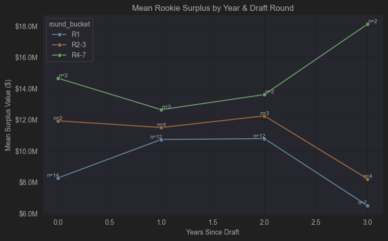
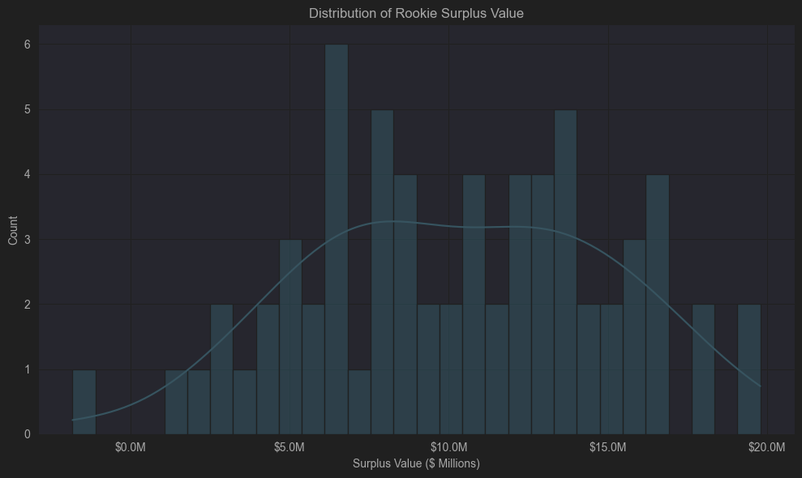
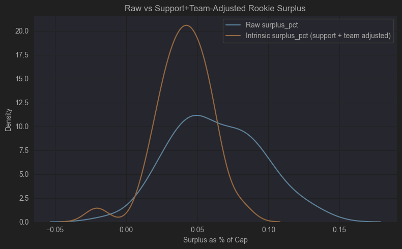
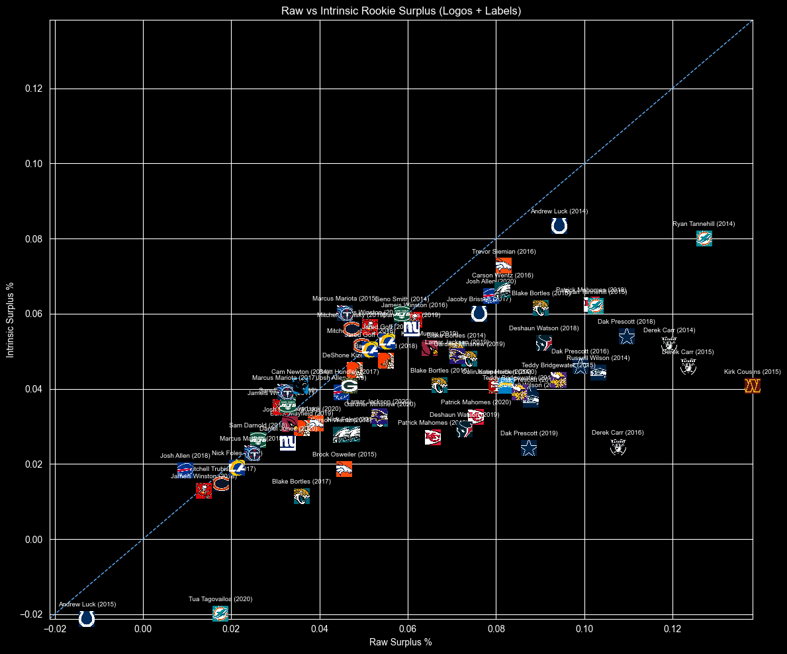

# **Evaluating Rookie Quarterback Surplus Value in the NFL**
### *A Data-Driven Analysis of Performance, Salary Efficiency, and Team Context*
**Author:** Liam McNulty
**Course:** MTH 362 – Mathematical Modeling
**Date:** *December 2025*


## **1. Introduction**

Quarterback salary allocation is one of the most important strategic decisions in the NFL.
Teams must decide whether to:

1. **Pay a veteran quarterback**, often at a premium market rate, or
2. **Draft a rookie quarterback**, hoping to capture elite performance at a fraction of the cost.

This project investigates how much value rookie quarterbacks generate **relative to veteran salary expectations**, and how that value changes once we adjust for **team environment and offensive support**.

Specifically, we examine:

- The statistical relationship between quarterback performance and salary
- How rookie seasons compare to expected veteran market value
- How team spending on offensive positions impacts surplus value
- A fixed-effects adjustment that isolates “intrinsic” quarterback surplus
- Visual analysis using NFL team logos to illustrate player-level variation

Our objective is to quantify **surplus value**:

## Surplus Definition

$$
\text{Surplus} = \text{Predicted\ Veteran\ Market\ Salary} - \text{Actual\ Cap\ Hit}
$$


and analyze how rookie quarterbacks provide salary efficiency under different conditions.


## **2. Data Sources and Preparation**

This project uses a combined dataset built from:

- **QB season statistics (2006–2023)**
- **Team salary cap allocation percentages by position group**
- **Rookie contract values and years since draft**
- **Veteran quarterback salary data**

Key engineered variables include:

- **TD rate, INT rate, sack rate**
- **years_since_draft**
- **rookie_contract (boolean)**
- **surplus_value** (in dollars)
- **surplus_pct** (percentage of team cap)
- **team-level offensive spending percentages**
- **team_abbr** automatically mapped to NFLverse logo files

We filtered to quarterbacks with meaningful snap counts to avoid artificially inflated efficiency values.


## **3. Predicting Veteran Quarterback Salary**

To estimate the market value of quarterback performance, we trained a regression model using **only veteran QB seasons**.

We selected the final features using stepwise filtering and model diagnostics:

- Cmp
- Cmp %
- TD
- INT rate
- 1st downs
- Sack yards

This model predicts what a quarterback *should* earn based strictly on performance.

$$
\widehat{\text{cap hit}} = f(\text{passing efficiency}, \text{volume}, \text{turnovers}, \text{sacks})
$$

This forms the benchmark for identifying rookie surplus.


# Ridge Regression Results

Best Group Combo: ('Cmp', 'Cmp %', 'TD', 'int_rate', '1st', 'SckY')

Best R²: 0.41709541358581004

Best Alpha: 1.0


## **4. Rookie Surplus Value**

Using the veteran salary model, we compute rookie surplus:

$$
\text{Surplus Value} = \widehat{\text{Veteran Salary}} - \text{Rookie Cap Hit}
$$

Rookie deals allow teams to capture performance at a fixed and very low cost, enabling potentially extreme surplus if the rookie performs well.

We examine surplus:

- As a **raw dollar amount**
- As a **percentage of team cap**
- Grouped by **round** and **contract year**


### **4.1 Surplus by Year Since Draft**

Rookie contracts last four years.
We evaluate how surplus evolves from Year 0 → Year 3.

General findings:

- Round 1 QBs start lower but rise modestly
- Mid- and late-round QBs produce extreme outlier value
- Late-round rookies generate the **highest average surplus** overall
- Seems like you are almost guaranteed surplus, but is that surplus good enough to win?

Notes:
- Limited amount of data, especially for non round 1 QBs



## 4.2 Overall surplus distribution

Specific Seasons:
- Andrew Luck, 2015: Only season with negative values
    - Threw 293 passes in 7 games; 15 - 12 TD:INT Ratio; 2-5 Win loss; A lot of the negative value comes from incredibly inefficient passing
- Kirk Cousins, 2015: Highest surplus value
    - Set multiple franchise passing records; 9 - 7 Win-loss (Won Division Title; Incredibly efficient passing; First full season as a starter


The rest of this project will get more into the "Why" of what team building strategy lead to good and bad seasons

Looking briefly, The Redskins spent nearly 20% more of the cap towards their offense than the Colts, specifically 10% more of their cap went towards OL


# 5 What team building strategy allows for teams to get the most surplus out of their rookie QB?

Correlation between surplus value and cap spending (Everything was changed to be percentages of cap space so comparing between years is easier)

| Variable      | Correlation |
|:-------------:|:-----------:|
| QB_pct        | -0.153984   |
| RB_pct        | 0.039419    |
| WR_pct        | 0.131574    |
| TE_pct        | -0.039621   |
| OL_pct        | 0.274099    |
| Offense_pct   | 0.172647    |
| surplus_pct   | 1.000000    |


- As can be seen, spending on the offense will allow the QB to shine, specifically spending on offensive line making the most difference
- As the QB's cap hit increases, their surplus decreases
- Spending on RB and TE is not really going to get more value out of your QB, but this doesn't take into account full team offense and how spending in those positions leads to an overall better offense


## 5.1 Spending in good vs bad Rookie seasons

<table>
<tr>

<td>

### **Good Rookie Seasons (Top 25%)**
| Variable      | Corr |
|:-------------:|:----:|
| QB_pct        | 0.046726 |
| RB_pct        | 0.045530 |
| WR_pct        | 0.105575 |
| TE_pct        | 0.047777 |
| OL_pct        | 0.175345 |
| Offense_pct   | 0.420954 |

</td>

<td>

### **Bad Rookie Seasons (Bottom 25%)**
| Variable      | Corr |
|:-------------:|:----:|
| QB_pct        | 0.059769 |
| RB_pct        | 0.047178 |
| WR_pct        | 0.093055 |
| TE_pct        | 0.045866 |
| OL_pct        | 0.144760 |
| Offense_pct   | 0.390628 |

</td>

<td>

### **Difference (Good − Bad)**
| Variable      | Diff |
|:-------------:|:----:|
| QB_pct        | -0.013043 |
| RB_pct        | -0.001648 |
| WR_pct        | 0.012521  |
| TE_pct        | 0.001911  |
| OL_pct        | 0.030585  |
| Offense_pct   | 0.030326  |

</td>

</tr>
</table>


## 5.2 How does year over year change in spending affect year over year surplus?
Correlation between change in spending vs change in surplus:

QB_pct_chg        -0.006211

RB_pct_chg        -0.113346

WR_pct_chg         0.085127

TE_pct_chg        -0.045615

OL_pct_chg         0.264369

Offense_pct_chg    0.161671

surplus_pct_chg    1.000000

- As the QB's salary goes up, you require more production to reach the same amount of surplus value
- Spending more on RBs and TEs negatively affects production
    - I am interested to see if this changes, multiple recently drafted TEs (Loveland, Bowers, Warren) have become QBs favorite targets and could lead to more surplus
- WR and OL spending have the most significance to increasing surplus


# 6 Spending vs Full Team production

## Correlation Summary (Rookie vs All Teams, PTS vs EXP)

<table>
<tr>
<td>

### **Rookie PTS Correlations**
| Variable      | Corr |
|:-------------:|:----:|
| Pts           | 1.000000 |
| WR_pct        | 0.194608 |
 |
| Offense_pct   | 0.130741 |
| OL_pct        | 0.119626 |
| RB_pct        | 0.012707 |
| TE_pct        | -0.005003 |
| QB_pct        | -0.134646 |

</td>
<td>

### **Rookie EXP Correlations**
| Variable      | Corr |
|:-------------:|:----:|
| EXP           | 1.000000 |
| WR_pct        | 0.206507 |
| OL_pct        | 0.177504 |
| Offense_pct   | 0.153168 |
| TE_pct        | 0.047797 |
| RB_pct        | -0.051298 |
| QB_pct        | -0.168347 |

</td>
</tr>

<tr>
<td>

### **All Teams PTS Correlations**
| Variable      | Corr |
|:-------------:|:----:|
| Pts           | 1.000000 |
| WR_pct        | 0.194608 |
| Offense_pct   | 0.130741 |
| OL_pct        | 0.119626 |
| RB_pct        | 0.012707 |
| TE_pct        | -0.005003 |
| QB_pct        | -0.134646 |

</td>
<td>

### **All Teams EXP Correlations**
| Variable      | Corr |
|:-------------:|:----:|
| EXP           | 1.000000 |
| WR_pct        | 0.206507 |
| OL_pct        | 0.177504 |
| Offense_pct   | 0.153168 |
| TE_pct        | 0.047797 |
| RB_pct        | -0.051298 |
| QB_pct        | -0.168347 |

</td>
</tr>
</table>


- Looking at all of these different correlations, you still end up coming to pretty much the same conclusions
    - Spending more on the offense -> improved offensive performance
    - OL very important for expected points, slightly less important for points
    - Spending money on the QB actually leads to less pts no matter what
        - Less money to go around
        - Could be due to year over year differences in offense around the league in general, normalization of data may show slightly different results
    - If you want to score points, spend money on the guys that get in the end zone (specifically WR)


# 7 Is the value in the QB, or the players around them?

The following plot is based on a model which takes into account the spending of the team, and uses that to "predict" what their surplus percentage should be. It also takes into account how good the teams have recently been at creating QB value, and creates a seperate score for each team

$$
\hat{Y} = \hat{\beta}_0
        + \hat{\beta}_{\text{OL}} \cdot \text{OL\_pct}
        + \hat{\beta}_{\text{Off}} \cdot \text{Offense\_pct}
        + \text{TeamFixedEffect}
$$

This is then subtracted from the QB's original surplus value to try to show their surplus value independent of the players around them



Only 4 QB's appear in the top 15 in raw surplus value and team adjusted surplus

- ('Patrick Mahomes', 2018) - First season as starter, 5k yards and 50 TDs, quite literally a top season of all time
- ('Blake Bortles', 2015) - 4400 yards, 35 Tds, led league in interceptions with 18, also led league in sacks with 51
- ('Andrew Luck', 2014) - 4700 yards, 40 TDs (led league), 16 picks
- ('Ryan Tannehill', 2014) - 4000 yards, 27 TDs, 12 picks, Very high in efficiency statistcs like QBR

## 7.2 Biggest Risers and Fallers Due to Support Adjustment

<table>
<tr>

<td style="vertical-align:top; padding-right:20px;">

### **Biggest Rank Risers**
*(Benefit from support-adjustment)*

| Name               | Year | Team      | Raw Surplus % | Intrinsic Surplus % | Raw Rank | Intrinsic Rank | Δ Rank |
|-------------------|------|-----------|---------------|----------------------|----------|----------------|--------|
| Marcus Mariota     | 2015 | Titans     | 0.045691      | 0.060047             | 47       | 9              | +38    |
| Mitchell Trubisky  | 2019 | Bears      | 0.047196      | 0.055817             | 45       | 14             | +31    |
| Jameis Winston     | 2015 | Buccaneers | 0.051330      | 0.056382             | 41       | 13             | +28    |
| Geno Smith         | 2014 | Jets       | 0.058659      | 0.059959             | 35       | 10             | +25    |
| Mitchell Trubisky  | 2018 | Bears      | 0.049426      | 0.051484             | 42       | 20             | +22    |
| Jameis Winston     | 2016 | Buccaneers | 0.061478      | 0.058393             | 33       | 12             | +21    |
| Marcus Mariota     | 2017 | Titans     | 0.032171      | 0.039110             | 58       | 38             | +20    |
| Jared Goff         | 2018 | Rams       | 0.055307      | 0.052602             | 36       | 17             | +19    |
| Daniel Jones       | 2019 | Giants     | 0.060862      | 0.055801             | 34       | 15             | +19    |
| Jared Goff         | 2017 | Rams       | 0.051469      | 0.050452             | 40       | 22             | +18    |

</td>


<td style="vertical-align:top;">

### **Biggest Rank Fallers**
*(Lose ranking after adjustment)*

| Name               | Year | Team      | Raw Surplus % | Intrinsic Surplus % | Raw Rank | Intrinsic Rank | Δ Rank |
|-------------------|------|-----------|---------------|----------------------|----------|----------------|--------|
| Derek Carr         | 2016 | Raiders    | 0.107581      | 0.024397             | 6        | 57             | −51    |
| Dak Prescott       | 2019 | Cowboys    | 0.087418      | 0.024238             | 17       | 58             | −41    |
| Kirk Cousins       | 2015 | Redskins   | 0.138135      | 0.040676             | 1        | 35             | −34    |
| Russell Wilson     | 2015 | Seahawks   | 0.087821      | 0.037055             | 15       | 42             | −27    |
| Dak Prescott       | 2017 | Cowboys    | 0.087423      | 0.038533             | 16       | 41             | −25    |
| Derek Carr         | 2015 | Raiders    | 0.123514      | 0.045929             | 3        | 28             | −25    |
| Deshaun Watson     | 2019 | Texans     | 0.072885      | 0.029189             | 27       | 51             | −24    |
| Russell Wilson     | 2014 | Seahawks   | 0.103081      | 0.044296             | 7        | 30             | −23    |
| Patrick Mahomes    | 2019 | Chiefs     | 0.065668      | 0.027064             | 31       | 54             | −23    |
| Teddy Bridgewater  | 2014 | Vikings    | 0.085334      | 0.039016             | 18       | 39             | −21    |

</td>

</tr>
</table>

Biggest Risers:
- Marcus Mariota, 2015
    - Rookie year, 12 games, 2800 yards, 19 tds, 10 int
    - 28th ranked OL (PFF)
    - Leading receiver was 31 yo TE Delanie Walker with 1000 yards
    - next closest receiver had just under 600
    - Leading rusher had 520 yards, and Mariota was 2nd on the team in rushing
- Mitch Trubisky, 2019
    - Year 3, 15 games, 3100 yards, 17 tds, 10 picks
    - Leading receiver (Allen Robinson) had 1000 yards
    - Leading Rusher (David Montgomery) had just under 900 yards
    - 25th ranked OL (PFF)
    - Somewhat surprising to see him rise so much as his supporting cast really wasn't all that bad, but since the model is based on money spent this could cause issues due to some other players on rookie deals on the roster

Biggest Fallers:
- Derek Carr, 2016
    - Year 3, 15 games, 3900 yards, 28 tds, 6 int
    - 4th ranked OL
    - Amari Cooper & Crabtree over 1000 yards
    - Latavius Murray had 800 yards and 12 rushing TDs, 2 other RBs over 400 yards
- Dak Prescott, 2019
    - Year 4, 16 games, 4900 yards, 30 TDs, 11 picks
    - 4th ranked OL
    - Ezekiel Elliot had 1350 yards with 12 TDs rushing
    - Amari Cooper & Michael Gallup had over 1000 yards, Randall Cobb close behind with 800





# 8 Final Conclusions
- If you want to get value out of your QB, invest in the OL
- If you want to score points, invest in the guys who get in the end zone (WRs mainly)
- The CBA has led to higher salaries for earlier draft picks, making it much more difficult to get that surplus value out of a first round QB


# 8.1 Continued Exploration
- More expansive datasets
    - As efficiency stats heavily drive the model, getting access to advanced analytics such as EPA could benefit the models success a lot
    - The data I worked with only allowed me to capture around 70 seasons of players on rookie contracts; Expanding this to more current data as well as going further back in history could help
- Look into the future play of these quarterbacks. For example, how do QBs who were put in good situations according to the model (High spending on OL and the offense as a whole) perform after getting their next contract where there may be less money going around. Comparatively, how do the QBs who outperformed or underperformed based on their situation fare? Also look into results of future contracts, and see how much teams may think a QB could succeed if placed in a better situation in the future

# References
- Draft info: https://www.kaggle.com/datasets/datadraco/nfl-quarterback-index
- Salary Data: https://www.kaggle.com/datasets/f4k25g/nfl-salaries
- QB Stats: https://www.kaggle.com/datasets/supremeleaf/nfl-qb-stats-1970-2022
- Full team Salaries: https://overthecap.com/positional-spending
- Supplemental statistics: https://www.pro-football-reference.com/
- OL Rankings: https://www.pff.com/
- Team Logos from: https://github.com/nflverse/nflverse-pbp/tree/master/squared_logos


```python

```
